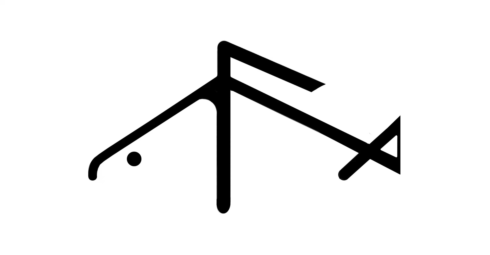

# 摸摸鱼-极客们的匿名社交群Dev（未完成）

## 摸摸鱼的由来

我是叁，一个无名的大学生。

我想通过我的微薄能力去搭建一个匿名同行聊天平台，我的宗旨是简洁且高效。

在经历过互联网兴起的年代我的能力并不算突出，但是我有一颗热爱生活的心。

我享受到了科技给生活带来的很多便利，我也想能为其中贡献出一份微薄的力量。

而我的生活也仅仅是大部分大学生的一个缩影。我渴求知识可以改变我的命运。

我每每看到代码在键盘中跳动内心就会激动不已，也许我就是为了科技而生。

我每次看到996带来的负面消息使我的内心非常沉重，我认为这并不是我所理想的乌托邦。

而我仅仅是一名大学生，并不能什么太多的改变。只能是将全部的想法寄托给MiniFish，

能让我在以后工作时候可以再次享受到代码给我带来的快乐。也希望通过MiniFIsh能结交到更多的大牛，

让我的能力变得更强去改变一丢丢的现状。

我做不成英雄，我能做的只有改变现在。

## 摸摸鱼

宗旨：简洁， 高效

项目未完成状态，还在努力肝代码。

